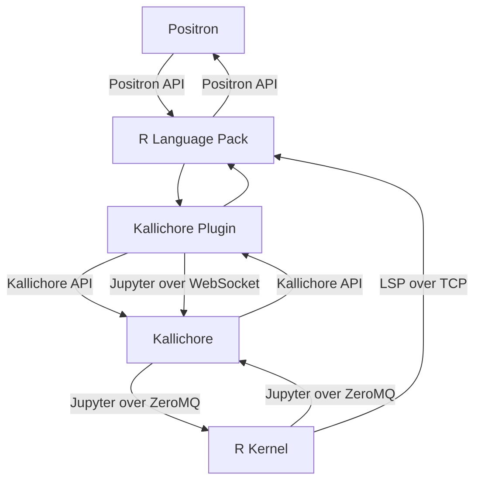

# Kallichore Builds 

This repository hosts builds of Kallichore, Positron's Jupyter kernel supervisor.

### What is Kallichore?

Kallichore is a high-performance, headless Jupyter kernel supervisor written in Rust. 

It is used by [the Positron IDE](https://github.com/posit-dev/positron) to provide durable Jupyter kernel sessions, especially in [Posit Workbench](https://posit.co/products/enterprise/workbench/). It takes care of much of the minutiae of Jupyter kernel management (ZeroMQ, process interop, lifecycle supervision, etc.) and exposes a high-level API that Positron uses to control kernel sessions and to send and receive Jupyter messages.

Kallichore is a companion to Posit's [Amalthea and Ark](https://github.com/posit-dev/ark) projects. Like Amalthea, it is a Jupyter-adjacent project named after [one of Jupiter's moons](https://science.nasa.gov/jupiter/moons/kallichore/). Kallichore is also [one of the Muses](https://en.wikipedia.org/wiki/Callichore). 

Here's how Kallichore functions in the larger Positron ecosystem for e.g. an R session:

### What are these builds?

These are binary release builds of `kcserver`, the Kallichore server, for all major operating systems.

### What are they for?

These builds are bundled as part of Positron, and are made available here for easy access when building Positron. 

### Is Kallichore open source?

No. Its binaries are licensed for use in Positron, but its source code is not public.

## Related Projects

[Jupyter Server REST API](https://jupyter-server.readthedocs.io/en/latest/developers/rest-api.html)

[Jupyter Kernel Gateway](https://jupyter-kernel-gateway.readthedocs.io/en/latest/)

[ARK, an R kernel](https://github.com/posit-dev/ark)

